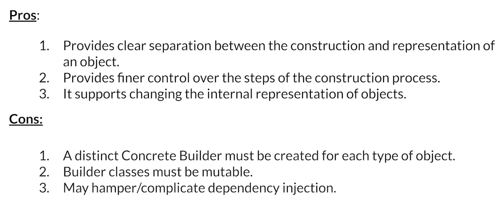
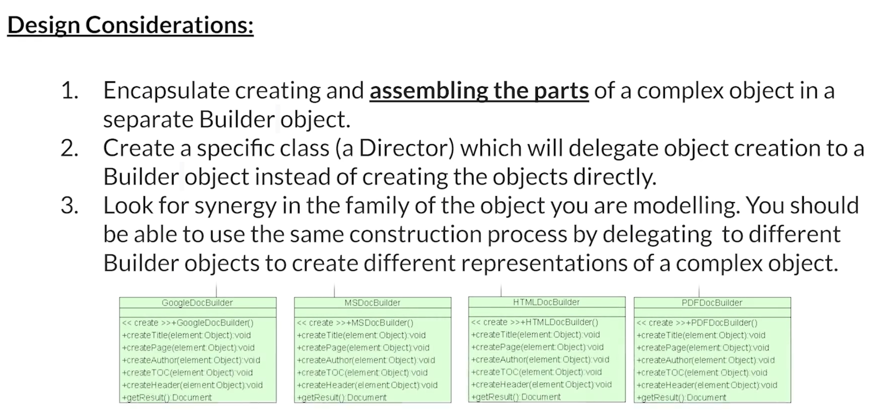
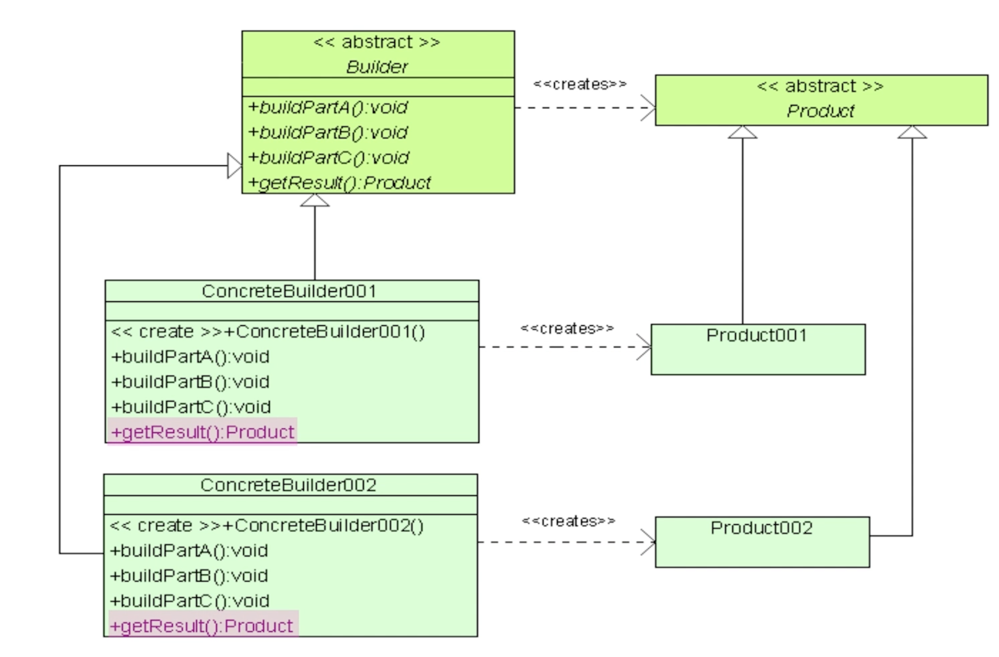
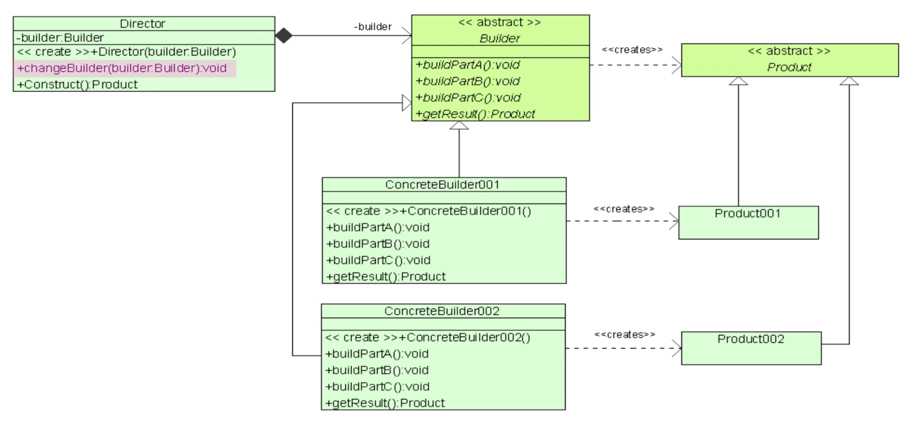
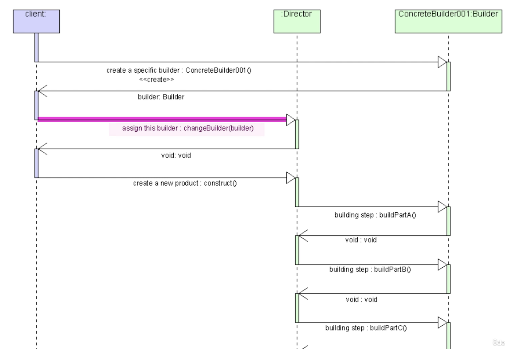

# builder_pattern

Builder Pattern
Used to encapluate reusable logic of complicated objects.

```
class Product {
  // fields for the product
  final int id;
  final String name;
  final double price;

  // private constructor
  Product._(this.id, this.name, this.price);

  // builder class
  // 빌더 인스턴스를 만든다.
  // 빌더 인스턴스가 다시 프로덕트를 만든다.
  factory Product.builder() => new _ProductBuilder();
}

class _ProductBuilder implements Product {
  int id;
  String name;
  double price;

  // methods for setting the fields
  setId(int id) => this.id = id;
  setName(String name) => this.name = name;
  setPrice(double price) => this.price = price;

  // build method
  Product build() => new Product._(id, name, price);
}

void main() {
  // create the builder
  Product.builder()
    // set the fields
    ..setId(1)
    ..setName('Product 1')
    ..setPrice(19.99)
    // build the product object
    ..build();
}
```

- 생성하는 과정에 대한 추상화를 해서 클래스자체와 생성을 분리할 수 있다.
- 단계별 빌드를 각각 메소드로 나눌수있고 필수적인것이 아니라면 생략할수도 있다.
- 복잡한 오브젝트를 만들때 적합하다. 간단한 것은 그냥 factory를 쓰는 것이 낫다.







## Design Considerations




- getResult의 리턴값이 추상값이다.



- Director클래스로 빌더의 타입을 지정할 수 있다.
- 두가지 방식이 있는데 디렉터를 만들때 빌더타입을 지정해주거나
- 만든 후에 changeBuilder함수를 이용해서 바꿔주는것이다.
- 그러고나서 Construct()를 하면 디렉터가 내부적으로 빌더로 buildPartA, buildPartB를 다라락 실행해서 Product를 만들어주면 된다.




- 클라이언트는 특정 빌더를 생성하고
- 디렉터에게 이 빌더로 생산을 요청한다.
- 그러면 디렉터가 빌더를 이용해서 프로덕트를 생산해준다.
- 클라이언트는 원하는 프로덕트의 종류를 알고 생성하는 과정은 모른다.
- 디렉터는 생성하는 과정은 알지만 프로덕트의 종류에 대해서는 모른다.
- 프로덕트마다 특별 로직이 필요하다면 디렉터 안에서 코딩해야한다.
